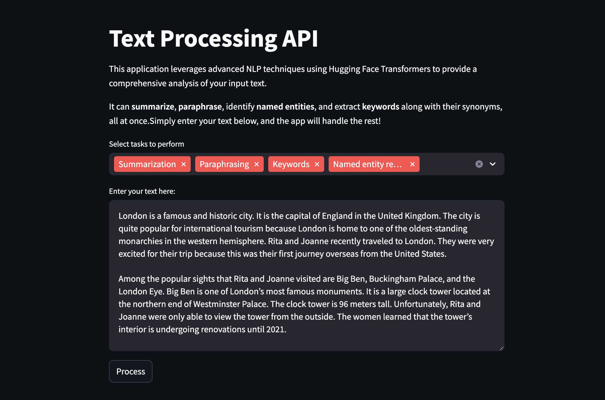
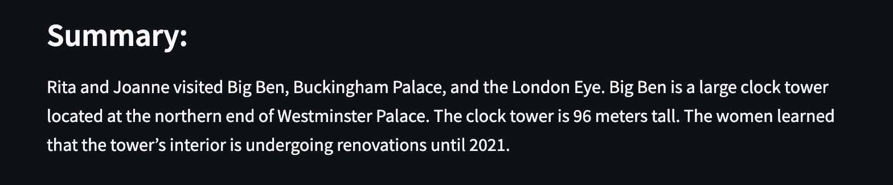
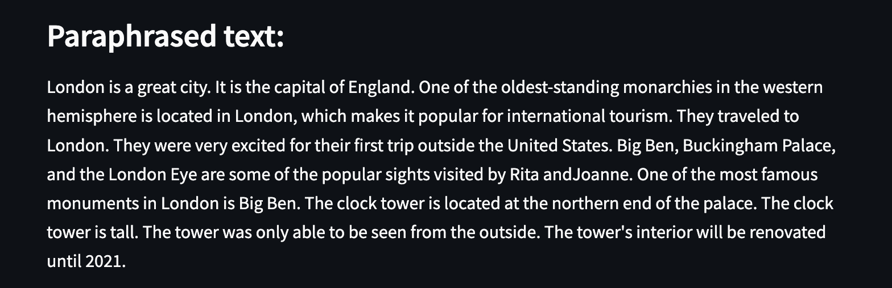
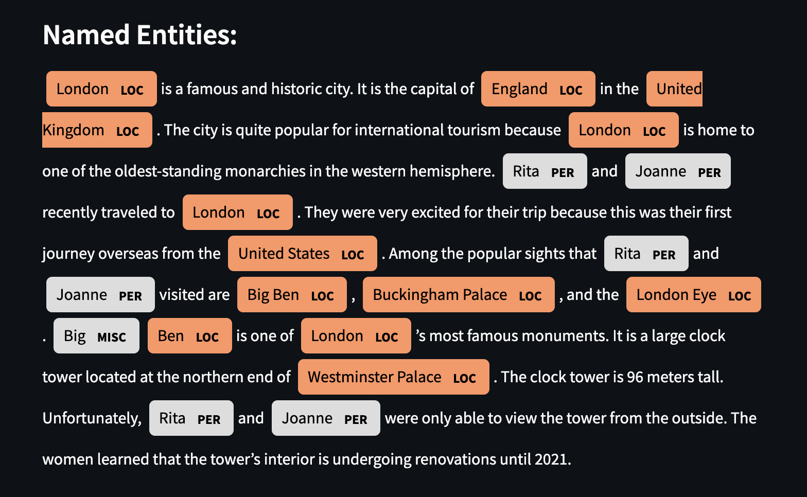
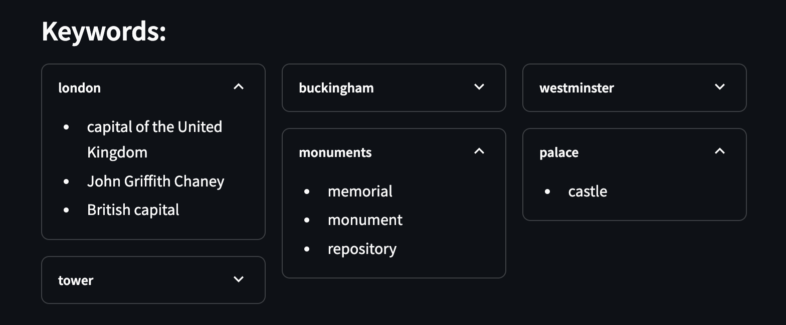

# Text processing App

This Streamlit app is designed for text processing tasks. It includes features like summarizing, paraphrasing, named entity recognition (NER), keyword extraction, and finding synonyms.

## Features

1. **Summarization**: Create short and clear summaries of long texts using **[BART](https://huggingface.co/facebook/bart-large-cnn)**, a model designed for summarizing.
    

2. **Paraphrasing**: Rephrase text in a new way while keeping the original meaning, powered by **[Pegasus](https://huggingface.co/google/pegasus-xsum)**.
    

3. **Named Entity Recognition (NER)**: Identify names, organizations, locations, and other important entities from the text using **[DistilBERT](https://huggingface.co/distilbert-base-uncased)**.
    

4. **Keyword Extraction**:

- Find important keywords from the text with **[KeyBERT](https://github.com/MaartenGr/KeyBERT)**, using BERT-based embeddings.
- Get synonyms for words in the text using **[WordNet](https://www.nltk.org/nltk_data/)**, a large lexical database of English words.
   

